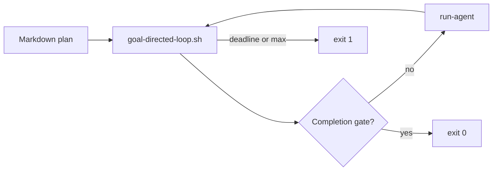

# Goal-directed loop

**High level:** write a plan → loop an SDK agent → stop when the plan is **fully** done.



## 1. Write the plan (markdown)

One goal file, e.g. `data/goal-directed-sprints/my-sprint.md`:

| Section | Purpose |
|---------|---------|
| `### Phase A` … | Ordered deliverables |
| Status table | `\| **A** \| **DONE** \|` when a phase is finished |
| `## Completion gate` | `bash` block — objective proof the whole plan is done |

The agent updates the status table. The loop runs the gate script every iteration.

## 2. Run the loop

From `li-cursor-agents` (built: `npm run build`):

```bash
export CURSOR_API_KEY=...
export BENCHMARKS_ROOT=../benchmarks   # optional preflight
export LIC_ROOT=../lic

./scripts/goal-directed-loop.sh \
  --goal-file ../data/goal-directed-sprints/my-sprint.md \
  --agent code_implementer \
  --workflow-repo lic \
  --cwd ../lic
```

## 3. Stop conditions

| Outcome | Exit | When |
|---------|------|------|
| **Success** | `0` | `goal-completion-gate.js` passes (bash gate + all phases **DONE**) |
| **Time box** | `1` | `--until-local 18:00` reached without completion |
| **Iteration cap** | `1` | `--max N` reached without completion |
| **Single shot** | `0` or `1` | `--once` — success only if gate passes after one agent run |

**Default:** no `--max` → unlimited iterations until completion. Agent exit 0 alone **never** ends the loop successfully.

Optional bounds can combine: `--max 50 --until-local 08:00`.

## Launcher (Windows)

```powershell
.\scripts\start-goal-directed-sprints.ps1 -Sprint benchmarks-dashboard -Max 0 -UntilLocal "18:00"
```

`-Max 0` = no iteration cap (completion only). Set `-Max 12` to cap iterations.

## Env

| Variable | Purpose |
|----------|---------|
| `CURSOR_API_KEY` | Required for SDK runs |
| `LI_GOAL_LOOP_STRICT_EXIT=1` | Set by loop — agent exit 2 when deliverable incomplete |
| `LI_GOAL_COMPLETION_SCRIPT` | Override gate script path |
| `LI_GOAL_LOOP_SLEEP_SEC` | Pause between iterations (default 90) |


## When tools block you

Goal-directed runs must **self-unblock** — see skill **`agent-self-unblock`**.

- Read/StrReplace denied → Shell + Python read/write, or Write for new files
- Native Li / lidb work → WSL verify (`scripts/verify-ph-db-wsl.sh` at workspace root when present)
- Do not stop the loop for hook noise; only stop for missing secrets/auth or completion gate failure

## Related

- YAML todo plans + `plan-loop.py`: skill `run-goal-directed-plan-loop` (httpd overnight pattern)
- Repo routing: skill `explore-li-ecosystem`
