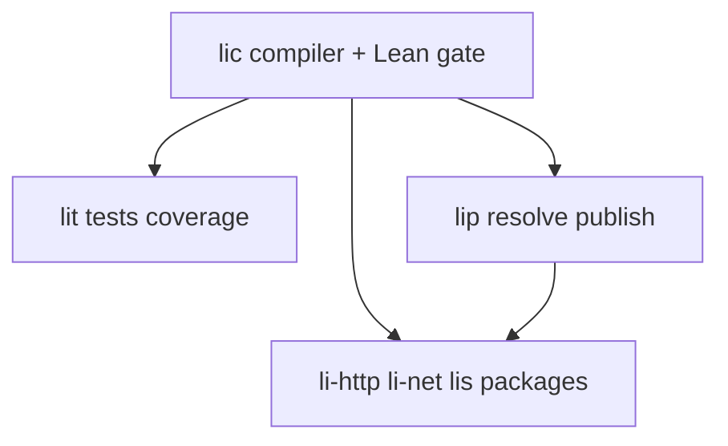

# Agent coordination & language evolution

<!-- DOC-ecosystem-agent-coordination -->

**Audience:** Cursor agents and maintainers working across **`li-langverse`** repos while the **language**, **compiler**, and **ecosystem** evolve in parallel.

**Read first:**

| Topic | Document |
|-------|----------|
| **Mandatory: functionality, security, performance** | [engineering-standards.md](engineering-standards.md) |
| Vision / master plan vs package vs roadmap | [vision-and-roadmap.md](vision-and-roadmap.md) |
| Org policy, `PKG-*`, new repos | [governance.md](governance.md) |
| `lic` releases → dependents | [upstream-notifications.md](upstream-notifications.md) |
| Master plan (human-only actions) | [master plan](https://github.com/li-langverse/lic/blob/main/docs/superpowers/plans/2026-05-14-li-master-plan.md) |
| CVE catalogs & fuzz | [security testing](https://github.com/li-langverse/lic/blob/main/docs/testing/security.md) |
| Package layout | [creating-packages.md](https://github.com/li-langverse/lic/blob/main/docs/guide/creating-packages.md) |

---

## Problem we are solving

1. **Language changes** in **`lic`** break or obsolete downstream packages (**lip**, **lit**, **lis**, `li-*`).
2. **Multiple agents** may edit the same repo, branch, or path without knowing each other.
3. Work must stay **proved**, **secure**, and **performant** — enforced by [engineering-standards.md](engineering-standards.md) (not optional agent judgment).
4. **CVE-relevant tests** must run for every security-touching PR ([security testing](https://github.com/li-langverse/lic/blob/main/docs/testing/security.md)).

This page ties **local agent coordination** to **org-wide upstream notifications** and **CI expectations**.

### Cursor hooks (project-local)

Committed in **`lic`** at `.cursor/hooks.json`:

| Hook | Role |
|------|------|
| `sessionStart` | Remind: engineering-standards, vision, three gates, std 100% |
| `beforeShellExecution` | Block force-push, `reset --hard`, `--no-verify`; block `cat` of secret paths |
| `afterFileEdit` (`std/**`) | Remind 100% coverage + tests |
| `afterFileEdit` (`docs/ecosystem/*`, `docs/superpowers/plans/*`) | Remind vision placement (master plan vs package) |
| `stop` | Suggest `ci.sh` / security if sensitive paths touched |

Override blocks with `LI_HOOK_ALLOW=1` only when intentional.

---


## Multi-agent coordination (local)

### Coordination file (never commit)

Path (sibling of checkouts):

```text
/Users/<you>/Documents/coding-projects/.li-agent-coord.json
```

Same directory level as `li/`, `lip/`, `lit/`, `lis/` — **local only**, listed in **`lic`** `.gitignore`.

### Schema (version 1)

```json
{
  "version": 1,
  "_doc": "LOCAL ONLY — never git add/commit",
  "updated_at": "2026-05-16T13:40:00Z",
  "workers": [
    {
      "id": "unique-worker-id",
      "agent": "cursor-agent",
      "status": "in_progress",
      "started_at": "2026-05-16T15:45:00Z",
      "repos": ["lip", "lic"],
      "tasks": ["ci-fix-push"],
      "note": "short human-readable summary"
    }
  ],
  "claims": [
    {
      "repo": "lip",
      "branch": "main",
      "paths": [".github/workflows/ci.yml"],
      "holder": "unique-worker-id"
    }
  ],
  "completed": ["2026-05-16: pushed lip main"]
}
```

### Agent rules

| Before you edit | Do |
|-----------------|-----|
| Start a multi-step task | Add a `workers[]` entry; set `status` to `in_progress` |
| Touch a path for >15 min | Add a `claims[]` row (`repo`, `branch`, `paths[]`, `holder`) |
| Finish or abandon | Set `status` to `done` or remove claim; append `completed[]` |
| See overlapping claim | **Stop** — coordinate with the user or pick another repo/path |
| End of session | Set `updated_at`; clear stale `in_progress` older than 24h |

**Do not** store tokens, passwords, or issue bodies with secrets in this file.

### GitHub org access (local CLI)

Fine-grained PAT for agents (optional):

```text
coding-projects/.env.github   # GH_TOKEN=... — chmod 600, never commit
```

```bash
cd li-language
./scripts/with-github-env.sh gh auth status
./scripts/push-li-langverse-repos.sh   # when human approves bulk push
```

Cloud **release → downstream** dispatch uses repo secret `LI_DOWNSTREAM_DISPATCH_TOKEN` on **`lic`** — separate from `.env.github`. See [upstream-notifications.md](upstream-notifications.md).

---

## Language evolution → downstream packages

### Dependency layers



| Upstream change | Downstream must |
|-----------------|-----------------|
| `lic` API / `edition` / proof rules | Bump `li-toolchain.toml`; fix proofs; re-run full CI |
| `lit` coverage gate | Bump `lit_version`; refresh coverage baselines |
| `lip` lock format | Regenerate `li.lock`; update resolve tests |
| Registry package | Bump `li.toml` dep; `lip install` |

### Pin file: `li-toolchain.toml`

Every **official** repo should pin:

```toml
[toolchain]
lic_version = "0.1.0"    # or lic_commit = "abc123"
lit_version = "0.1.0"
```

CI runs `scripts/check-li-toolchain.sh` (when landed) to compare pins to latest **`lic`** / **`lit`** releases.

### When `lic` releases

1. **`lic`** workflow `notify-downstream.yml` fires on tag `v*`.
2. Repos in **`.github/li-downstream-repos.txt`** receive `repository_dispatch` (`li-upstream-release`).
3. Each repo’s **`ecosystem-upstream.yml`** opens an issue or bump PR.
4. Maintainer updates `li-toolchain.toml`, fixes breakages, merges when **3-OS CI** is green.

**Agent rule:** Adding an official repo → same PR updates `official-packages.md` **and** `li-downstream-repos.txt`.

### While language is in flux

| Policy | Detail |
|--------|--------|
| Prefer **monorepo** `packages/` in **`lic`** or **`lis`** until **8a** (`import`) + **8b** (`lip`) stable | See [governance plan](https://github.com/li-langverse/lic/blob/main/docs/superpowers/plans/2026-05-16-li-ecosystem-governance.md) |
| **Do not** hand-roll packages | Use `li-new-package` + lip § A3 |
| Breaking language change | Update **REQ-** / **PH-** ids; add **T-** test; note in **CHANGELOG**; bump **edition** if needed |
| Downstream not yet green | Document `*push pending*` or `blocked on PH-8a` in official-packages table |

---

## What “everything works” means (CI matrix)

| Repo type | Minimum CI (today → target) |
|-----------|-----------------------------|
| **`lic`** | build + `li-tests` + security + fuzz/memory (see workflows) |
| **`lip` / `lit`** | infra + toolchain check + (later) `lic build` of tool |
| **`lis`** (httpd) | 3-OS infra + security + load TOML; later + `lic build` + tier5 exploit |
| **`lic` `std/**`** | **100%** line coverage (`check-stdlib-coverage.sh`) + `stdlib_seal` suite |
| **Official `li-*` package** | `lic build` + `lit` ≥80% + `check-traceability.sh` |

**Security:** `li-tests/security/`, tier5 exploit TOML, Lean gate — not optional for release branches.

**Performance:** tier2/tier5 benchmarks; regression policy in benchmark docs — run on nightly, investigate >2× regressions.

---

## New agent checklist (start of session)

1. Read [engineering-standards.md](engineering-standards.md) — **functionality, security, performance** are strict.
2. Read [vision-and-roadmap.md](vision-and-roadmap.md) — where to put vision changes.
3. Read [master plan](https://github.com/li-langverse/lic/blob/main/docs/superpowers/plans/2026-05-14-li-master-plan.md) phase tracker — know current **PH-** gate.
4. Open **`.li-agent-coord.json`** — avoid claimed paths.
5. Identify repo: **`lic`** vs **`lip`** vs **`lit`** vs **`lis`** vs org package.
6. Run local **`./scripts/ci.sh`** (+ security scripts if touching parser/net/crypto/http).
7. Language-breaking work → list affected downstream repos from [official-packages.md](official-packages.md).
8. New ecosystem feature → document **“Learned from”** per engineering-standards.
9. Org/repo/settings/secrets → post **“Action needed from you”** and **wait** ([master plan](https://github.com/li-langverse/lic/blob/main/docs/superpowers/plans/2026-05-14-li-master-plan.md)).
10. End session → update coordination file; note what downstream still needs bumps.

---

## Related repos

| Repo | Role |
|------|------|
| [li-langverse/lic](https://github.com/li-langverse/lic) | Language + compiler (upstream) |
| [li-langverse/lip](https://github.com/li-langverse/lip) | Package manager |
| [li-langverse/lit](https://github.com/li-langverse/lit) | Tests + coverage |
| [li-langverse/lis](https://github.com/li-langverse/lis) | li-httpd server (infra phase) |
