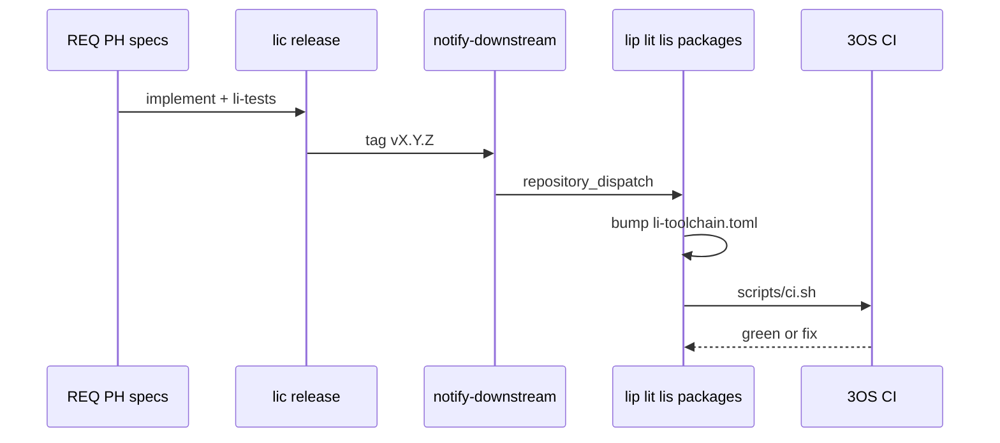

# Language evolution & downstream health

<!-- DOC-ecosystem-language-evolution -->

When **`lic`** changes, the ecosystem must **stay consistent**: proofs, pins, security tests, and benchmarks.

## Single workflow

## Maintainer responsibilities

| Role | Action on `lic` minor/major |
|------|------------------------------|
| **`lic` maintainer** | CHANGELOG; migration note; update downstream list if new consumer |
| **Package maintainer** | Bump pin; fix compile/proof failures; extend **T-** tests if behavior changed |
| **Agent** | Do not merge downstream PRs that only silence errors — preserve **security/perf** gates |

## Edition and breaking changes

- `edition = "2026"` in `li.toml` (lip § A3) — resolver rejects incompatible deps.
- Breaking change **requires** semver major on **`lic`** and migration section in CHANGELOG.
- Document in [language design spec](https://github.com/li-langverse/lic/blob/main/docs/superpowers/specs/2026-05-14-li-language-design.md) with new **REQ-** id.

## Tracking table

Use [official-packages.md](official-packages.md) columns:

- **Phase** — blocked on which **PH-**
- **depends_on** — `PKG-lic`, `PKG-lit`, …
- **Notes** — e.g. `awaiting 8a import`

## See also

- [agent-coordination.md](agent-coordination.md) — multi-agent + CI expectations
- [upstream-notifications.md](upstream-notifications.md) — secrets and dispatch setup
