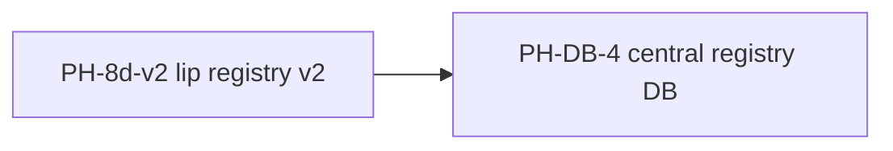

# Vision & roadmap governance

<!-- DOC-ecosystem-vision-roadmap -->

**Where visions live** so agents and humans do not fork the story per repo.

## Layers

| Scope | Canonical home | Updates when |
|-------|----------------|--------------|
| **Language + compiler + org** | [Master plan](https://github.com/li-langverse/lic/blob/main/docs/superpowers/plans/2026-05-14-li-master-plan.md) | Pillars, phases **PH-***, new repo policy, cross-cutting gates |
| **Ecosystem governance + agent-kit** | **This repo** | Engineering standards, coordination, PR-only agent-kit |
| **Milestones & themes** | [docs/roadmap/](../../roadmap/) | PH-linked status, quarterly themes |
| **Benchmarks dashboard** | [`li-langverse/benchmarks`](https://github.com/li-langverse/benchmarks) | Ingested CSV, regression overview |
| **Product / package** | Each package `README.md`, `PUBLISH.md`, `docs/traceability.md` | Package scope only — not language syntax |
| **Server (li-httpd)** | [li-httpd plan](https://github.com/li-langverse/lic/blob/main/docs/superpowers/plans/2026-05-16-li-httpd-plan.md) + **`lis`** repo | Agent gateway features |
| **Living gaps** | [provability-gaps.md](https://github.com/li-langverse/lic/blob/main/docs/verification/provability-gaps.md) | What is **not** proved yet |

**Rule:** If a change affects **more than one package** or **Li pillars**, update the **master plan** and open a **proposal** here (human merge). Do not hide ecosystem vision only in a package README.

### This repo

- **Governance** — `docs/ecosystem/` (canonical; `lic` has stubs)
- **Milestones** — `docs/roadmap/`; master plan stays normative for **PH-** order
- **Agent-kit** — `agent-kit/`; install into code repos via `scripts/install-agent-kit.sh`
- Agents: read **engineering-standards** + **this page** + **master plan PH tracker** each session

---

## North star — go-to ecosystem (agents: read first)

**Li aims to become the go-to open ecosystem for high-performance computing (HPC), scientific computing, and AI** — not a general-purpose scripting language with optional proofs.

| Domain | What “go-to” means in Li |
|--------|---------------------------|
| **HPC** | Native CPU performance: LLVM, SIMD, `parallel for`, OpenMP; tier benchmarks; race/disjointness are **compile errors**, not runtime surprises |
| **Scientific computing** | Simulation-shaped types and stdlib; reproducible builds; **`lic build`** = Lean certificate on shipped code |
| **AI** | Agent-first tooling (`lic` structured diagnostics, `lis` gateway, observability, safe edge defaults) — with **provable bounds** where code ships, not “move fast and skip contracts” |

**Agents:** Prioritize work that advances this north star (benches, proved kernels, `lip`/`lit`/`lis`, CVE/perf gates). Defer generic-app or syntax-only churn unless a **PH-** row or master-plan gate requires it. Cross-cutting features belong in the **master plan** + roadmap proposal, not a lone package README.

**Not the goal:** “Python speed with a new syntax,” optional proof, or perf claims without dashboard evidence ([benchmarks](https://li-langverse.github.io/benchmarks/)).

---

## Li vision (non-negotiable)

All ecosystem work must reinforce the north star through:

1. **Easy** — Nim-like surface; low ceremony; TOML/config desugar
2. **AI-first** — agents, streaming, observability, safe defaults at the edge
3. **Secure** — proofs + typed config + CVE-informed tests + minimal trusted base
4. **Provable** — `lic build` = Lean; no `sorry` in user code
5. **Blazingly fast** — LLVM, SIMD, OpenMP; measured regressions; no perf claims without benches

See [engineering-standards.md](engineering-standards.md) for how agents enforce this daily.

---

## Li data platform (PH-DB-0 … PH-DB-10)

**Normative ADR:** [`proposals/lidb-li-data-platform.md`](../../proposals/lidb-li-data-platform.md) · **Native engine (N1–N6):** [`proposals/lidb-native-engine.md`](../../proposals/lidb-native-engine.md) · **Research (PH-DB-G0):** [`proposals/lidb-multi-model-gpu-research.md`](../../proposals/lidb-multi-model-gpu-research.md) · **Package:** [`PKG-lidb`](official-packages.md) (*proposed* repo)

**Cross-phase dependency (lip):** **`PH-8d-v2`** (remote registry, full trust store) **→ `PH-DB-4`** (registry v2 central DB on `lidb`). Do not ship **8d v2** until PH-DB-4 exit gate is met.

| Phase | ID | Deliverable | Depends |
|-------|-----|-------------|---------|
| 0 | **PH-DB-0** | Proposal + ADR; lic / roadmap cross-links | — |
| 1 | **PH-DB-1** | Native WAL/heap + SQL executor; sqlite smoke **deprecated** | PH-DB-0; [`lidb-native-engine.md`](../../proposals/lidb-native-engine.md) N2–N3 |
| 2 | **PH-DB-2** | `liorm` + `liq` + security harness stubs | PH-DB-1 |
| 3 | **PH-DB-3** | `lis db` supervisor + `registry-min` profile | PH-DB-1 |
| 4 | **PH-DB-4** | Registry v2 on lidb; `lip publish` → central DB | PH-DB-1–3, lip OpenAPI |
| 5 | **PH-DB-5** | Auth + RLS for publishers | PH-DB-4 |
| 6 | **PH-DB-6** | Object storage vertical | PH-DB-4 |
| 7 | **PH-DB-7** | Realtime (`lis` broker; N5 protocol, N6 RLS) | PH-DB-4; N5 → N6 |
| 8 | **PH-DB-8** | Vectors + flexible embedding spaces | PH-DB-1 |
| 9 | **PH-DB-9** | PostgREST-style auto-API + edge stub | PH-DB-4 |
| 10 | **PH-DB-10** | Control-plane store migration (li-cursor-agents) | PH-DB-4 |

**Benchmark evidence:** [`tier_db_registry`](https://github.com/li-langverse/benchmarks/blob/main/docs/ecosystem/tier-db-registry-benchmark.md) (lands with benchmarks `feat/tier-db-registry` if not yet on `main`) — see [benchmark tier index](benchmark-tier-index.md).

**Master plan:** add a **PH-DB** row in [lic master plan](https://github.com/li-langverse/lic/blob/main/docs/superpowers/plans/2026-05-14-li-master-plan.md) when the next lic governance PR merges; this table is the roadmap copy until then.
