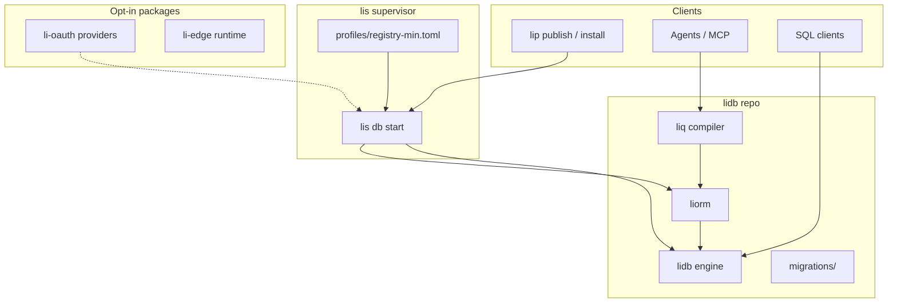

# Li Data Platform (`lidb` + `lis` bundle)

**Status:** Draft (PH-DB-0)  
**Date:** 2026-05-25  
**PH / REQ:** PH-DB-0 … PH-DB-10, REQ-registry-v2, lip **8d v2**  
**Research track:** [`lidb-multi-model-gpu-research.md`](./lidb-multi-model-gpu-research.md) (PH-DB-G0 — multi-model + GPU; out of PH-DB-1..4 scope)  
**Native engine:** [`lidb-native-engine.md`](./lidb-native-engine.md) (legacy N1–N6 labels)  
**Competitor matrices + WP-N1…N9:** [`lidb-native-li-matrices.md`](./lidb-native-li-matrices.md)  
**Native Li ADR (lidb repo):** [`lidb/docs/architecture-native-li.md`](https://github.com/li-langverse/lidb/blob/main/docs/architecture-native-li.md) — **PH-DB-3.1** sqlite removal

## Context

The Li package **registry** needs a production database backing a purchased domain release. Today:

- **lip 8d v1** uses a local `registry/index.json` ([`2026-05-16-li-package-manager-lip.md`](https://github.com/li-langverse/lic/blob/main/docs/superpowers/plans/2026-05-16-li-package-manager-lip.md) § 8d).
- **li-cursor-agents** control plane uses Supabase/Postgres (`src/db/read-query.ts`, `.env.supabase`).

We need a **Li-native, Postgres-shaped engine** (`lidb`) plus a **lean Supabase-parity stack** bundled for low setup overhead — not a 15-container compose — while keeping SQL, a secure ORM, and an agent-oriented query language.

## Decision

Adopt a phased **PH-DB-*** program (new org repo **`lidb`**, supervisor in **`lis`**) documented here and cross-linked from the compiler master plan. **Registry v2 central DB** lands at **PH-DB-4**; **8d v2** in `lip` depends on it.

### North star

| Pillar | Target |
|--------|--------|
| **Engine** | `lidb` — embedded + wire-capable Postgres subset; WAL/heap; AI-first schema introspection; encryption defaults |
| **Bundle** | `lis db start` — one process, `registry-min` profile, ≤256 MiB RAM for registry-only |
| **Security** | `liorm` + `liq` — parameterized-by-construction; exploit regression suite; SQL escape hatch audited |
| **Parity** | Supabase verticals as **optional modules**, not mandatory microservices |
| **Evidence** | `tier_db_registry` in benchmarks vs Postgres 15+; footprint doc; no perf/security gate weakening |

**Not a goal:** byte-for-byte Postgres compatibility or multi-year clone before registry MVP.

## Architecture (bundle)

## Core packages

| Package | Role | Default in bundle |
|---------|------|-----------------|
| **`lidb`** | Storage engine, SQL subset, migrations, vectors, RLS hooks | yes (library) |
| **`lis`** | `lis db start\|status\|migrate\|stop`; profiles; ports **54321** (API) / **54322** (SQL) | yes (binary) |
| **`liorm`** | Typed ORM; `execute(plan_id, params)`; catalog-bound identifiers | yes (in `lidb/`) |
| **`liq`** | Token-efficient query AST → IR → SQL; agent default | yes (in `lidb/`) |
| **`li-oauth`** | OAuth/OIDC provider adapters | no — heavy deps |
| **`li-edge`** | Edge functions runtime | no — PH-DB-8+ |

Env contract (registry-min): `LI_DATA_DIR`, `LI_PROFILE=registry-min`, optional `LI_LISTEN`.

## Supabase verticals (abbreviated checklist)

| Vertical | Li home | MVP (registry-min) | Full stack |
|----------|---------|-------------------|------------|
| **Database** | `lidb` | WAL, heap, migrations, registry schema | Replication, branching |
| **Auth** | `lis` + `lidb` RLS | API keys, publisher JWT | Email, magic link; OAuth via `li-oauth` |
| **Storage** | `lidb` blob + `lis` | — | S3-compatible API |
| **Realtime** | `lis` broker | — | WAL fanout, presence |
| **Edge Functions** | `li-edge` | — | WASM/Li sandbox |
| **Vector / AI** | `lidb` | — | Multi-dim embeddings, HNSW |
| **Auto API (PostgREST)** | `lis` | read-only registry routes | Full CRUD from schema |
| **Studio** | external / `ui` | — | Admin UI |
| **CLI / local dev** | `lis` | `lis db start` | `lis db branch` |
| **Migrations** | `lidb` + `lis db migrate` | `001_registry.sql` | Branching |
| **RLS** | `lidb` | publisher-scoped publish | policy language |
| **Webhooks** | `lidb` triggers | — | signed outbound |
| **Observability** | `li-log` integration | structured logs | metrics |
| **Pooling** | in-process | single conn pool | optional sidecar |
| **Vault** | `lidb` KMS hooks | env secrets | HSM opt-in |
| **Cron** | `lis` scheduler | — | pg_cron parity subset |

## Packaging map

| Component | `lidb` | `lis` | Separate `lip:` package | Rationale |
|-----------|--------|-------|---------------------------|-----------|
| Engine + WAL | ✓ | embed | — | core |
| SQL parser/executor | ✓ | — | — | core |
| Migrations | ✓ | invoke | — | core |
| Registry schema | ✓ | — | — | PH-DB-1 |
| `liorm` | ✓ | — | — | shares catalog |
| `liq` | ✓ | — | — | compiles to SQL |
| Auth core (JWT, API keys) | hooks | ✓ | — | needs supervisor |
| OAuth providers | — | — | `li-oauth` | large dep tree |
| REST registry API | — | ✓ proxy | — | lip OpenAPI → lis |
| Realtime | hooks | ✓ | — | broker in supervisor |
| Object storage | ✓ | ✓ | — | optional module flag |
| Edge runtime | — | — | `li-edge` | Deno-scale deps |
| Connection pool | ✓ | ✓ | — | in-process only |

**Anti-pattern:** dozens of `@li/*` npm-style packages for each vertical — use **feature flags** in `profiles/*.toml` instead.

## Footprint targets

| Profile | RAM (idle) | Processes | Notes |
|---------|------------|-----------|-------|
| **registry-min** | ≤ **256 MiB** | 1 (`lis`) | lidb in-process; no realtime/storage |
| **dev-full** | ≤ **512 MiB** | 1 | auth + storage modules on |
| **Supabase local compose** (reference) | ~2–4 GiB | 10+ | not a ship target |

Document evidence in `lidb/docs/footprint.md` (WP1); CI optional nightly.

## Registry-min path

1. **PH-DB-0** — this ADR + roadmap release note (no runtime).
2. **PH-DB-1** — `lidb` repo: native WAL/heap + SQL executor (`001_registry.sql`); **sqlite smoke removed** per [`lidb-native-engine.md`](./lidb-native-engine.md).
3. **PH-DB-2** — `liorm`/`liq` skeleton + security test stubs.
4. **PH-DB-3** — `lis db start` + `profiles/registry-min.toml`.
5. **PH-DB-4** — `lip` registry v2 REST + central DB; domain TLS (human).
6. **PH-DB-5…9** — auth RLS, storage, realtime, vectors, auto-API (module flags).
7. **PH-DB-10** — migrate li-cursor-agents control plane off Supabase.

**Native WPs (WP-N*, after PH-DB-0):** parallel batch **A** — **N1** heap/WAL C++ ∥ **N2** SQL/Li executor ∥ **N3** realtime changefeed ∥ **N4** benchmark matrix CI ∥ **N5** security harness; then **PH-DB-3.1** sqlite cutover; sequential **N6** PG wire ∥ **N7** RLS+auth ∥ **N8** vector ∥ **N9** `lidb-graph`. See [`lidb-native-li-matrices.md`](./lidb-native-li-matrices.md).

**Ecosystem WPs (parallel with native):** lip OpenAPI prep ∥ `tier_db_registry`; **lis** bundle (**PH-DB-3**) after **PH-DB-3.1** native cutover.

## Phased roadmap PH-DB-0 … PH-DB-10

| Phase | ID | Deliverable | Depends |
|-------|-----|-------------|---------|
| 0 | **PH-DB-0** | Proposal + ADR (this doc); lic cross-links | — |
| 1 | **PH-DB-1** | Native engine: WAL/heap pages, SQL executor, registry migration; sqlite smoke **deprecated** | PH-DB-0; [`lidb-native-engine.md`](./lidb-native-engine.md) N2–N3 |
| 2 | **PH-DB-2** | `liorm` + `liq` + security harness stubs | PH-DB-1 |
| 3 | **PH-DB-3** | `lis db` supervisor + `registry-min` profile | PH-DB-1 |
| 3.1 | **PH-DB-3.1** | Remove sqlite3 smoke from CI/engine (`embed_engine.py`, `embedded.cpp`) | WP-N1 + WP-N2; [`architecture-native-li.md`](https://github.com/li-langverse/lidb/blob/main/docs/architecture-native-li.md) |
| 4 | **PH-DB-4** | Registry v2 on lidb; `lip publish` → central DB | PH-DB-1–3, lip OpenAPI; **blocks PH-8d-v2** |
| 5 | **PH-DB-5** | Auth + RLS for publishers | PH-DB-4 |
| 6 | **PH-DB-6** | Object storage vertical | PH-DB-4 |
| 7 | **PH-DB-7** | Realtime (`lis` broker + WAL fanout; N5 protocol, N6 RLS) | PH-DB-4; N5 before N6 |
| 8 | **PH-DB-8** | Vectors + flexible embedding spaces | PH-DB-1 |
| 9 | **PH-DB-9** | PostgREST-style auto-API + edge stub | PH-DB-4 |
| 10 | **PH-DB-10** | Control-plane store migration | PH-DB-4 |

## Query surfaces

| Surface | Audience | Security |
|---------|----------|----------|
| **SQL** | humans, migrations, power users | prepared statements; role separation |
| **liq** | agents, apps, ORM backend | AST-only; no free-form strings from untrusted input |
| **liorm** | application code | `Ident::from_catalog()`; plan IDs; ≥80% coverage when implemented |

## Learned from

| System | Keep | Reject |
|--------|------|--------|
| **SQLite** | — | PH-DB-1 smoke only — **REMOVED** per [`lidb-native-engine.md`](./lidb-native-engine.md) |
| **Neon** | storage/compute separation ideas | managed-only ops model |
| **pgvector** | embedding index patterns | Postgres extension baggage |
| **Supabase** | vertical feature map, RLS story | 10-container compose default |
| **DuckDB** | columnar analytics hooks (later) | OLAP-first storage for registry OLTP |

## Consequences

- **Positive:** Registry domain release on owned stack; agent-safe defaults; benchable vs real Postgres.
- **Negative:** New org repo + multi-year engine work; **8d v2** blocked until PH-DB-4.
- **Risks:** Scope creep (full Postgres clone) — gated by `pg-subset-v1` NOT list; human gate for `li-langverse/lidb` repo creation.

## Future research (PH-DB-G0)

Multi-model storage (relational / document / graph) and GPU acceleration are **out of PH-DB-1..4 scope**. See **[`lidb-multi-model-gpu-research.md`](./lidb-multi-model-gpu-research.md)** for the research plan, bench proposals, and ADR decision table. **registry-min** remains CPU-only with relational + JSONB until that ADR promotes optional `lidb-graph` / `lidb-gpu` modules.

## Links

- **Native engine:** [`lidb-native-engine.md`](./lidb-native-engine.md), [`lidb-native-li-matrices.md`](./lidb-native-li-matrices.md), [`lidb/docs/architecture-native-li.md`](https://github.com/li-langverse/lidb/blob/main/docs/architecture-native-li.md)
- **Research:** [`lidb-multi-model-gpu-research.md`](./lidb-multi-model-gpu-research.md) (PH-DB-G0)
- **Ecosystem PH table:** [`docs/ecosystem/vision-and-roadmap.md`](../docs/ecosystem/vision-and-roadmap.md#li-data-platform-ph-db-0--ph-db-10) — includes **PH-8d-v2 → PH-DB-4**
- **PKG-lidb:** [`docs/ecosystem/official-packages.md`](../docs/ecosystem/official-packages.md)
- **Bench tier index:** [`docs/ecosystem/benchmark-tier-index.md`](../docs/ecosystem/benchmark-tier-index.md) → `tier_db_registry`
- Master plan (lic): [2026-05-14-li-master-plan.md](https://github.com/li-langverse/lic/blob/main/docs/superpowers/plans/2026-05-14-li-master-plan.md) — PH-DB row (sibling PR)
- lip 8d: [2026-05-16-li-package-manager-lip.md](https://github.com/li-langverse/lic/blob/main/docs/superpowers/plans/2026-05-16-li-package-manager-lip.md) — registry v2 DB → PH-DB-4 (**PH-8d-v2** blocked until PH-DB-4)
- Release note: [`docs/release-notes/2026-05-25-lidb-proposal.md`](../docs/release-notes/2026-05-25-lidb-proposal.md)
