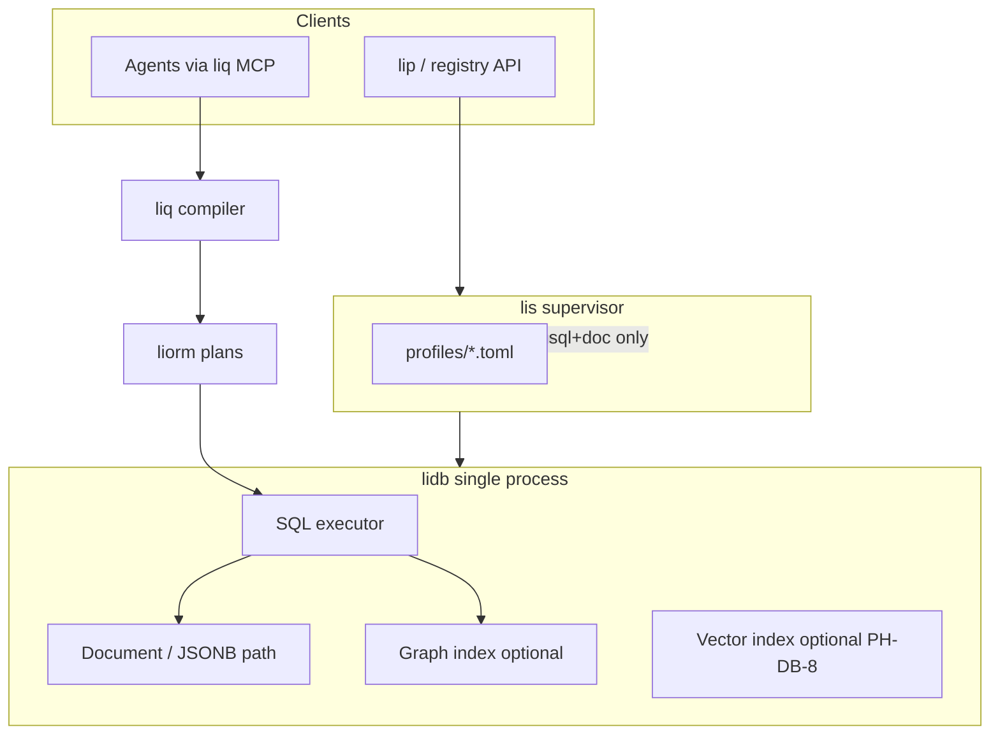
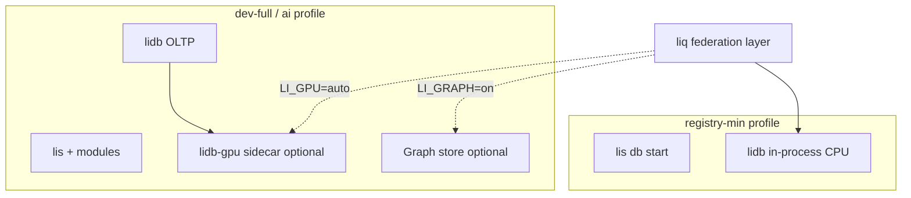

# lidb Multi-Model + GPU Research Plan

**Status:** Research (PH-DB-G0) — not implementation  
**Date:** 2026-05-25  
**Parent ADR:** [`lidb-li-data-platform.md`](./lidb-li-data-platform.md) (PH-DB-0)  
**PH / REQ:** PH-DB-G0 (research), PH-DB-1..10 (delivery), REQ-registry-v2, PH-DB-8 (vectors)

## Purpose

Answer whether **lidb** should be multi-model (relational + document + graph) and whether **GPU acceleration** belongs in the Li data platform—without breaking the **registry-min** contract (≤256 MiB RAM, CPU-only default, single `lis` process).

**Out of scope for this plan:** engine implementation, `liq` grammar finalization, or weakening PH-DB security/perf gates.

## Ecosystem anchors (read first)

| Path | Relevance |
|------|-----------|
| [`roadmap/proposals/lidb-li-data-platform.md`](./lidb-li-data-platform.md) | PH-DB-0..10, registry-min, vectors at PH-DB-8 |
| [`lic/docs/superpowers/plans/2026-05-14-li-master-plan.md`](https://github.com/li-langverse/lic/blob/main/docs/superpowers/plans/2026-05-14-li-master-plan.md) | **G-gpu** / device laws — codegen GPU, not DB GPU |
| [`benchmarks/docs/ecosystem/tier-db-registry-benchmark.md`](https://github.com/li-langverse/benchmarks/blob/main/docs/ecosystem/tier-db-registry-benchmark.md) | OLTP P95 vs Postgres; PH-DB-5 |
| [`benchmarks/benchmarks/tier_db_registry/schema/registry-v1.sql`](https://github.com/li-langverse/benchmarks/blob/main/benchmarks/tier_db_registry/schema/registry-v1.sql) | Relational + **JSONB** attestations today |
| [`li-cursor-agents/supabase/migrations/20260517120000_control_plane.sql`](https://github.com/li-langverse/li-cursor-agents/blob/main/supabase/migrations/20260517120000_control_plane.sql) | Control-plane: FK trees + heavy **jsonb** columns |
| [`li-cursor-agents/docs/plans/lidb-migration-control-plane.md`](https://github.com/li-langverse/li-cursor-agents/blob/main/docs/plans/lidb-migration-control-plane.md) | PH-DB-10: **liq** MCP, no raw SQL from agents |

---

## A. Multi-model architecture options

| Option | Description | Pros for registry + agents | Cons for registry + agents |
|--------|-------------|---------------------------|---------------------------|
| **A1 — Single engine, storage modes** | One `lidb` heap/WAL; tables (relational), document collections (JSON heap or JSONB column mode), graph as **edge tables** + optional adjacency index in same catalog | One migration story; **liq** one IR; registry-min stays one binary; RLS/policy once | Risk of “kitchen sink” engine; graph-at-scale may pollute OLTP code paths; harder to bench GPU in isolation |
| **A2 — SQL + graph query extension** | Relational core + **openCypher/GSQL subset** or **lig** graph surface compiled to plans (not free strings) | Natural for dep graphs / provenance traversals; agents get token-efficient graph reads via **liq** | Large parser/optimizer surface; subset drift vs Neo4j; security: graph injection if not plan-bound |
| **A3 — Federated: lidb OLTP + sidecar** | `lidb` embedded for registry/control-plane; optional **`lidb-gpu`** or external graph/vector process via same **liq** catalog federation | **registry-min** unchanged (CPU, in-process); GPU/graph only when profile enables | Two failure domains; consistency across stores; agent mental model “which backend?” |
| **A4 — Relational-only v1, graph as views** | Recursive CTEs + closure tables (`package_deps`, `run_parent`) + JSONB; no native graph store | Matches **registry-v1.sql** and control-plane FK+jsonb today; smallest PH-DB-1..4 scope | Multi-hop analytics at 10⁶+ edges may need graph module later |

### Architecture sketches (mermaid)

**A1 — Single engine (logical modes, physical unity)**



**A3 — Federated (recommended research default)**



**Research task (A):** Spike A4 for PH-DB-1..4; prototype A3 module boundaries before committing to A1 vs A2 native graph algebra.

---

## B. Graph database need

### Li use cases (concrete)

| Use case | Shape today | Graph-native benefit | MVP (PH-DB-1..4) |
|----------|-------------|----------------------|-------------------|
| **Package dependency graphs** | Mostly absent in registry-v1; lip resolve tree in files | Cycle detection, impact analysis, version conflict closure | **Later** — closure table or `package_edges` when lip needs central deps |
| **Provenance / attestation chains** | `attestations.payload` JSONB + FK to `package_versions` | Signed chain traversal, policy on path | **Relational + JSONB** (already in registry-v1) |
| **Agent run DAGs** | `agent_runs` + `agent_run_events`; `run_id` FKs | Parent/child run, tool-step DAG queries | **Later** — optional `run_edges` for PH-DB-10+ analytics |
| **Realtime presence graphs** | Not in registry-min | Fanout / who-sees-what | **PH-DB-7** (realtime), not graph store |

### Comparator survey (research reads)

| System | Fit for Li | Notes |
|--------|------------|-------|
| **Neo4j** | Reference / Learned from | Mature Cypher; heavy ops; not embedded |
| **Memgraph** | Optional sidecar benchmark | In-memory; good for latency studies |
| **Kùzu** | Strong embed candidate | Embedded analytical graph; **GPU roadmap** in vendor docs — align with **lidb-gpu** research |
| **DuckDB** | Analytics hook (ADR already “later”) | SQL graph extensions immature; great for bench OLAP slices |
| **Postgres AGE / pg_graph** | Parity oracle | Same SQL wire as Supabase today; good **A/B** for “do we need native graph?” |
| **SurrealDB** | Caution | Multi-model marketing vs operational footprint |

### MVP vs Later (registry)

| Tier | Recommendation |
|------|----------------|
| **MVP (PH-DB-1..4)** | **Relational + JSONB only** — matches [`registry-v1.sql`](https://github.com/li-langverse/benchmarks/blob/main/benchmarks/tier_db_registry/schema/registry-v1.sql) |
| **PH-DB-5..7** | Closure tables / materialized paths for deps if lip 8d v2 requires |
| **PH-DB-G1+** | Native graph module **if** benchmarks show CTE/path SQL >1.2× Postgres graph extension at 10⁵ edges |

---

## C. Non-relational modes

### What registry + control-plane actually need

| Mode | Needed? | Evidence in repo |
|------|---------|------------------|
| **Document / JSONB** | **Yes** | `attestations.payload`, `agent_runs.completion`, `meta`, snapshots |
| **Wide-column** | **No** (v1) | No column-family access patterns in registry DDL |
| **Key-value** | **Partial** | Briefing by `briefing_hash` ≈ KV; implement as PK lookup on relational table |
| **Blob** | **Later** | PH-DB-6 object storage for tarballs/proofs |

### **liq** alignment (token-efficient, multi-model)

Research deliverable: **liq IR** document model with stable field aliases across:

- relational rows (`read packages where name = @n limit 1`)
- json paths (`read attestations payload.proof_ref where …`) — compile to JSONB operators + plans
- future graph (`match (p:Package)-[:DEPENDS*1..3]->(q) …`) — **only** if PH-DB-G1 adopts graph module

**Anti-pattern:** separate agent query dialects per storage mode.

---

## D. GPU acceleration research

### When GPU wins (hypothesis → bench)

| Workload | GPU win condition | Li priority |
|----------|-------------------|-------------|
| **Vector ANN (HNSW/IVF)** | dim ≥128, corpus ≥10⁵, batch QPS | **PH-DB-8** — RAG for agents/registry search |
| **Graph traversal** | |E| ≥10⁶, high fanout, batch analytics | **Optional module** — not registry-min |
| **Embedding batching** | Offline ingest / publish pipeline | **lip** / agent indexer — may call **G-gpu** codegen path separately from DB |
| **Full-text at scale** | Massive corpus + concurrent token scans | **Later** — registry text index small |

### When GPU loses (default path)

| Workload | Why CPU default |
|----------|-----------------|
| **OLTP point lookups** | registry publish/read P95 — [`tier_db_registry`](https://github.com/li-langverse/benchmarks/blob/main/docs/ecosystem/tier-db-registry-benchmark.md) |
| **Small graphs** | |E| <10⁴ — recursive CTE + indexes faster than PCIe + kernel launch |
| **registry-min on laptop** | No CUDA/Metal assumption; ≤256 MiB budget |
| **Low batch size** | Transfer overhead dominates |

### Survey matrix (research readings)

| Technology | Role in research | Li stance |
|------------|------------------|-----------|
| HeavyDB / GPUdb (legacy) | Learned from — GPU SQL warehouse | Reject as OLTP core; analytics reference only |
| **Kùzu GPU** | Embedded graph + GPU experiments | Bench sidecar patterns for **lidb-gpu** |
| **NVIDIA cuGraph** | Batch BFS/PR/WCC | Sidecar analytics; not agent OLTP |
| **Graphistry** | Ops/visualization | Out of engine scope |
| **Faiss GPU** | ANN reference implementation | Compare to lidb HNSW CPU/GPU paths |
| **pgvector** (+ GPU variants) | Parity oracle for PH-DB-8 | Match API semantics, not extension lock-in |
| **Rockset** / analytics GPUs | Streaming SQL | Reject for registry-min footprint |

### Hybrid design (proposed API contract)

```
LI_GPU=off|auto|cuda|metal   # default: off in registry-min
LI_GPU_MIN_ROWS=65536        # batch threshold for vector ops
LI_GPU_MIN_EDGES=100000      # batch threshold for graph ops
```

- Same **liq** / **liorm** plan IDs; executor picks CPU vs GPU backend by catalog stats + env.
- **Metal** on Apple for dev laptops; **CUDA** on CI/nightly GPU runners only.

### Memory & security research notes

| Topic | Research question |
|-------|-------------------|
| **Unified memory (Apple / Grace)** | Does zero-copy offset PCIe enough for ANN at 10⁵ vectors? |
| **PCIe transfer** | Break-even batch size vs CPU AVX-512 for dot products |
| **GPU memory not zeroed** | Multi-tenant: no cross-publisher embedding caches without encrypted pages or process-per-tenant sidecar |
| **Tenant isolation** | Prefer **separate lidb-gpu process** over in-process CUDA in shared `lis` for multi-tenant registry |

---

## E. LLM-native database features

| Feature | Depends on | Phase |
|---------|------------|-------|
| **RAG: vector + FTS + graph expansion** | PH-DB-8 vectors + optional graph module | PH-DB-8 / PH-DB-G2 |
| **Schema / tool snapshots for agents** | Catalog introspection + **liq** `describe` | PH-DB-2 |
| **Flexible embedding dims** | Per-column `vector(d)` or external table keyed by model id | PH-DB-8 (ADR: multi-dim spaces) |
| **Agent-safe retrieval** | Allowlisted tables + plan-only reads (control-plane pattern) | PH-DB-2, PH-DB-10 |

**Learned from:** pgvector patterns ([`lidb-li-data-platform.md`](./lidb-li-data-platform.md)); reject Postgres extension baggage in **registry-min**.

---

## F. Phasing recommendation

| Phase | ID | Scope | Graph | GPU |
|-------|-----|-------|-------|-----|
| Research ADR | **PH-DB-G0** | This document + decision table + bench proposals | Evaluate A3/A4 | Evaluate hybrid API |
| Engine scaffold | **PH-DB-1** | WAL/heap, registry DDL | — | **off** |
| **liorm** / **liq** / security | **PH-DB-2** | JSONB path in IR | — | **off** |
| **lis** bundle | **PH-DB-3** | `registry-min.toml` CPU-only | — | **off** |
| Registry v2 | **PH-DB-4** | OLTP | closure tables only if needed | **off** |
| Auth / storage / realtime | **PH-DB-5..7** | — | optional `run_edges` | **off** |
| Vectors | **PH-DB-8** | HNSW CPU default | — | **optional** `lidb-gpu` nightly |
| Auto-API / edge | **PH-DB-9** | — | — | **off** default |
| Control plane | **PH-DB-10** | Migrate off Supabase | DAG views optional | **off** |
| Graph module | **PH-DB-G1** | `lidb-graph` or AGE-parity layer | **opt-in** | CPU first |
| GPU module | **PH-DB-G2** | `lidb-gpu` sidecar | graph ANN | **opt-in** |

### Footprint impact per profile

| Profile | Graph | GPU | RAM note |
|---------|-------|-----|----------|
| **registry-min** | No native store | **Forbidden default** | Stay ≤256 MiB — [`lidb-li-data-platform.md`](./lidb-li-data-platform.md) |
| **dev-full** | JSONB + CTE | `LI_GPU=auto` optional | ≤512 MiB without GPU libs loaded |
| **ai-dev** | `lidb-graph` module flag | `lidb-gpu` sidecar | Separate process; not counted in registry-min |

---

## G. Benchmarks to add (benchmarks repo)

Propose new catalog rows (tier 6 database family + new tier proposal):

| Bench id | Purpose | Engines | PH link |
|----------|---------|---------|---------|
| `tier_db_registry` (existing) | OLTP P95 | lidb CPU vs Postgres | PH-DB-5 |
| **`tier_db_graph_registry`** (new) | Dep closure / cycle check on synthetic registry graph | lidb CTE vs AGE vs Kùzu sidecar | PH-DB-G1 |
| **`tier_db_vector_ann`** (new) | ANN recall@k / QPS @ N=10⁴, 10⁶ | lidb CPU HNSW vs Faiss CPU vs lidb-gpu | PH-DB-8, PH-DB-G2 |
| **`tier_db_gpu_speedup`** (new) | Speedup ratio vs CPU at fixed accuracy | cuda/metal profiles | PH-DB-G2 |

**Graph subset:** LDBC SNB **interactive subset** (scaled-down) **or** custom [`registry dep graph`](https://github.com/li-langverse/benchmarks/blob/main/benchmarks/tier_db_registry/schema/registry-v1.sql) generator — prefer **custom** for Li relevance.

**Documentation:** `benchmarks/docs/ecosystem/tier-db-graph-proposal.md`, `tier-db-vector-gpu-proposal.md` (stubs in PH-DB-G0 PR).

**Gate:** No perf claim in ADR until CSV ingested (same honesty rule as [`tier-db-registry-benchmark.md`](https://github.com/li-langverse/benchmarks/blob/main/docs/ecosystem/tier-db-registry-benchmark.md)).

---

## H. Recommendation (verdict)

### Summary verdict

| Question | Verdict | Rationale |
|----------|---------|-----------|
| **Multi-model in one engine?** | **Logical yes, physical modular** — relational + JSONB in core; graph/GPU as **opt-in modules** (A3), not monolith | Protects registry-min; matches existing DDL |
| **GPU-accelerated database for Li?** | **Optional module (`lidb-gpu`)** — not in v1 engine | OLTP path is CPU; GPU for ANN/graph analytics when batched and hardware present |
| **Native graph store vs relational v1?** | **Later (`lidb-graph`)** — relational + JSONB + closure tables for MVP | registry-v1 and control-plane already relational; graph at PH-DB-G1 **if** benches fail |

### Package naming (bundle flags)

| Module | lip/lis flag | Default in registry-min |
|--------|--------------|-------------------------|
| Core `lidb` | (always) | yes |
| `lidb-graph` | `LI_GRAPH=off\|on` | **off** |
| `lidb-gpu` | `LI_GPU=off\|auto\|cuda\|metal` | **off** (`off` enforced) |

In `profiles/registry-min.toml`: `modules = []` — no graph, no gpu, no vector (vectors PH-DB-8 only in non-min profiles).

---

## ADR decision table (PH-DB-G0 outcomes)

| Decision | Options | **Recommended** | Evidence required before flip |
|----------|---------|-----------------|--------------------------------|
| D1 Storage topology | A1 monolith / A3 federated / A4 relational-only | **A3 federated** (CPU core + opt-in modules) | WP1 footprint doc; module load RAM |
| D2 Graph store in v1 | Yes native / No / Later module | **Later (`lidb-graph`)** | `tier_db_graph_registry` vs CTE @ 10⁵ edges |
| D3 Graph query language | openCypher subset / GSQL / **lig** graph / SQL only | **SQL + liq JSONB first**; lig graph **spike** in G0 | Agent token count + plan safety review |
| D4 GPU in engine | Built-in / sidecar / never | **Sidecar `lidb-gpu`** | `tier_db_gpu_speedup` @ N=10⁴,10⁶ |
| D5 GPU default | on / off / auto | **off** (registry-min); **auto** in ai-dev only | CI without GPU must stay green |
| D6 Vector index | CPU HNSW / GPU ANN | **CPU HNSW default**; GPU optional PH-DB-G2 | recall@k parity vs Faiss |
| D7 Multi-tenant GPU | in-process / process isolate | **Process isolate** | Security review: GPU mem retention |
| D8 Non-relational modes | doc/json / wide-column / kv | **JSONB + PK “KV”** only v1 | Schema survey registry + control-plane |
| D9 Bench gate | optional / required for module ship | **Required** for graph/GPU module promotion | benchmarks dashboard row green |

---

## Research work packages (PH-DB-G0)

| WP | Output | Owner | Timebox |
|----|--------|-------|---------|
| G0-1 | Literature + comparator matrix (§B, §D) | lidb | 1 week |
| G0-2 | A3 module boundary spike (`lis` profile flags) | lis + lidb | 1 week |
| G0-3 | Bench proposals merged to benchmarks | benchmarks | 3 days |
| G0-4 | Security note: GPU memory + multi-tenant | roadmap + lidb | 3 days |
| G0-5 | **liq** IR note: JSONB paths + future graph slot | lidb | 1 week |
| G0-6 | ADR sign-off: fill decision table with measured or “deferred” | human + agent | end G0 |

### Agent continuation (PH-DB-G0)

1. Read: this plan, [`lidb-li-data-platform.md`](./lidb-li-data-platform.md), [`tier-db-registry-benchmark.md`](https://github.com/li-langverse/benchmarks/blob/main/docs/ecosystem/tier-db-registry-benchmark.md), control-plane migration plan in li-cursor-agents  
2. Run: none (research only)  
3. Next: open PH-DB-G0 PR in **roadmap** linking here; add bench proposal stubs; cross-link from main ADR § “Future research”  
4. Blocked on: human sign-off D1/D2/D4; **lidb** repo creation for G0-2 spikes (PH-DB-1)

---

## Links

- Parent: [`lidb-li-data-platform.md`](./lidb-li-data-platform.md)  
- Release note: [`docs/release-notes/2026-05-25-lidb-proposal.md`](../docs/release-notes/2026-05-25-lidb-proposal.md)  
- Control plane: [`li-cursor-agents/docs/plans/lidb-migration-control-plane.md`](https://github.com/li-langverse/li-cursor-agents/blob/main/docs/plans/lidb-migration-control-plane.md)
