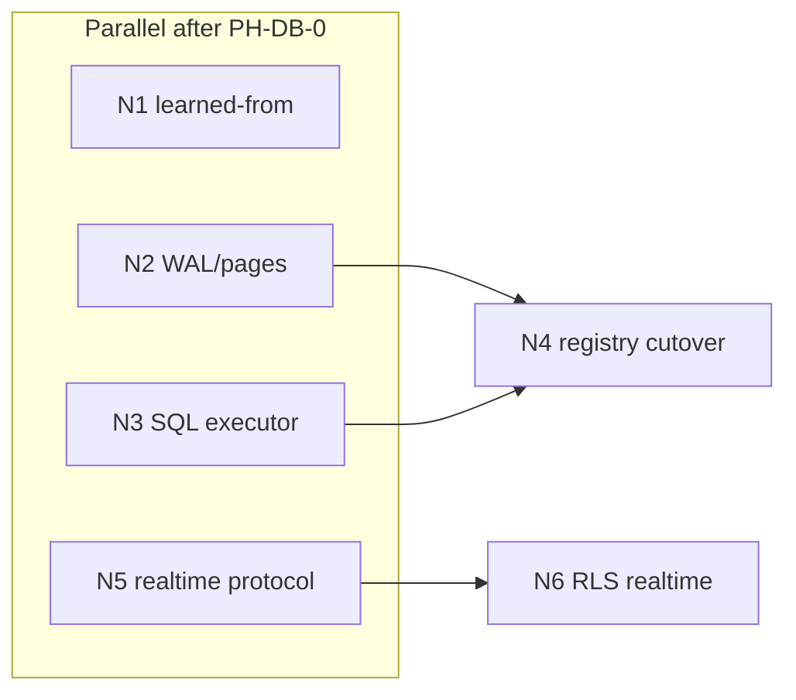

# lidb native engine + realtime vertical

**Status:** Draft (PH-DB-1 revision)  
**Date:** 2026-05-25  
**Parent ADR:** [`lidb-li-data-platform.md`](./lidb-li-data-platform.md) (PH-DB-0 … PH-DB-10)  
**PH / REQ:** PH-DB-1 … PH-DB-7, REQ-registry-v2

## Context

PH-DB-1 shipped an honest **sqlite3 smoke backend** (`001_registry_embedded.sql`, `lidb_embed` shelling to `sqlite3`) so `liorm`/`liq` could integrate before the native engine existed. That path is **deprecated** — not a ship target for registry-min or PH-DB-4.

**North star for PH-DB-1..4:**

| Layer | Target | Not a dependency |
|-------|--------|------------------|
| Storage | Native C++ heap + WAL pages (`engine/`, `src/`) | **SQLite** (no `sqlite3` in CI smoke after cutover) |
| SQL | Li/C++ parser + executor over native catalog | Postgres wire parity (phase later) |
| Bundle | **Realtime** protocol in **`lis`** (WAL fanout broker) | Separate microservice compose |

## Decision

1. **Deprecate** sqlite smoke by **2026-06-15** (remove from `scripts/smoke.sh`, `embedded.cpp`, `liorm/embed_engine.py` sqlite path).
2. **Implement** native storage + SQL executor in **`lidb`** (N2, N3).
3. **Ship** realtime as an optional **`lis` module** (N5 → N6), not inside registry-min.
4. **Gate** registry v2 cutover (N4) on N2 + N3 green + `tier_db_registry` skeleton.

## SQLite smoke — REMOVED path

| Artifact | Action |
|----------|--------|
| `migrations/001_registry_embedded.sql` | Archive → `migrations/deprecated/`; do not apply in native mode |
| `engine/embedded.cpp` `sqlite3` shell | Replace with native `Catalog::apply_migration` + `Executor::exec` |
| `liorm/embed_engine.py` sqlite3 | Route through `lidb_embed --exec` only (no Python sqlite3) |
| `scripts/smoke.sh` sqlite branch | Native INSERT/SELECT on `001_registry.sql` subset |
| CI | Drop `sqlite3` package requirement after cutover PR merges |

**Migration (operators + agents):**

1. Export smoke DB (if any local dev data): `sqlite3 .lidb/catalog.db .dump > /tmp/lidb-smoke-export.sql` (one-time).
2. `lis db stop && rm -rf "$LI_DATA_DIR"` (or new data dir).
3. `lis db migrate` applies **`001_registry.sql`** via native engine.
4. Re-import only rows that match registry schema (manual or `lidb import` stub in N4).
5. Verify: `bash scripts/smoke.sh` (native) + `bash scripts/run_tests.sh`.

Documented in [`lidb/docs/pg-subset-v1.md`](https://github.com/li-langverse/lidb/blob/main/docs/pg-subset-v1.md#sqlite-smoke-removed).

## Native engine scope (N2 + N3)

| Component | Deliverable | Evidence |
|-----------|-------------|----------|
| **WAL** | Append `LIDW` records; checkpoint stub; replay unit tests | `engine/wal_*`, `tests/wal_replay_test.cpp` |
| **Pages** | 8 KiB heap pages; pin/unpin; basic eviction | `engine/buffer_pool_*` |
| **Catalog** | `CREATE TABLE` / index metadata for registry subset | `migrations/001_registry.sql` applied natively |
| **Executor** | Parameterized `INSERT`/`SELECT`/`UPDATE`/`DELETE` for v1 types | `scripts/smoke.sh`, liorm `execute()` |
| **Interop** | `lidb_embed` CLI: `open`, `migrate`, `exec`, `status` | No external DB binary |

**Li code:** hot paths may use **Li** modules compiled to native via `lic` interop where policy allows; storage remains C++17 with ASan in CI.

## Realtime vertical (N5 + N6, `lis` bundle)

| Piece | Owner | Notes |
|-------|-------|-------|
| WAL logical decoding hook | `lidb` | Export change records (relation, op, key, payload) |
| Fanout broker | `lis` | WebSocket / SSE; channel = table+filter |
| Protocol v1 | `lis` + `docs/realtime-v1.md` (lidb repo) | Supabase-realtime-*shaped* topics, not full Phoenix parity |
| Auth on subscribe | `lis` + PH-DB-5 JWT | Tenant/channel binding |
| **N6** RLS-aware realtime | `lis` + `lidb` RLS hooks | **After N5** — filter events by `current_setting('request.jwt.claims')` |

**registry-min:** `modules = []` — no realtime. Enable in `profiles/dev-full.toml` only.

## Work packages (native track)

Scheduling for agent squads after PH-DB-0 merges.

| WP | ID | Title | Repo | Parallel? | Depends | Exit gate |
|----|-----|-------|------|-----------|---------|-----------|
| **N1** | learned-from | Comparator matrix + storage/SQL/realtime ADR pins (SQLite **reject**, Neon/DuckDB partial) | roadmap + `lidb/docs/` | **Yes** | PH-DB-0 | This doc + `pg-subset-v1` updated |
| **N2** | wal-pages | Native WAL + 8 KiB page heap | lidb | **Yes** | PH-DB-0 | WAL replay tests green |
| **N3** | sql-executor | Parser/executor over native catalog; parameterized exec API | lidb | **Yes** | PH-DB-0 (N2 helps but need not block start) | `smoke.sh` native INSERT/SELECT |
| **N5** | realtime-protocol | `lis` broker + lidb decode hook + `realtime-v1.md` | lis + lidb | **Yes** | PH-DB-0 | Subscribe/publish integration test |
| **N4** | registry-cutover | `liorm`/`lis db` on native engine; sqlite removed from CI | lidb + lis | **No** | **N2 + N3** | PH-DB-4 prep; `tier_db_registry` smoke |
| **N6** | rls-realtime | Channel filters respect RLS / JWT claims | lis + lidb | **No** | **N5**, PH-DB-5 RLS SQL | Security harness `rls-realtime` stub green |

### Scheduling diagram

**Parallel (start together):** N1, N2, N3, N5  
**Sequential:** N4 after N2 **and** N3; N6 after N5 (and PH-DB-5 RLS policies)

### Mapping to PH-DB phases

| Native WP | PH-DB phase |
|-----------|-------------|
| N1 | PH-DB-0 / PH-DB-1 docs |
| N2, N3 | PH-DB-1 (engine), PH-DB-2 (liorm wire) |
| N4 | PH-DB-3..4 (lis bundle + registry v2) |
| N5 | PH-DB-7 (realtime) — protocol first |
| N6 | PH-DB-5 + PH-DB-7 (RLS + realtime) |

## Learned from

| System | Keep | Reject |
|--------|------|--------|
| **SQLite** | — | Embedded smoke, `sqlite3` CLI dependency, divergent DDL |
| **Postgres** | WAL + heap mental model, registry DDL shape | Full extension surface |
| **Supabase Realtime** | Topic/channel ergonomics | Separate Elixir service in registry-min |
| **Neon** | WAL as replication source | Managed-only split |
| **DuckDB** | — for OLTP registry path | Columnar primary store |

## Agent continuation

1. **Read:** this doc, [`lidb-li-data-platform.md`](./lidb-li-data-platform.md), [`lidb/docs/pg-subset-v1.md`](https://github.com/li-langverse/lidb/blob/main/docs/pg-subset-v1.md)
2. **Run (lidb):** `bash scripts/smoke.sh` — note sqlite deprecation banner until N4 merges
3. **Pick WP:** N2/N3/N5 parallel agents; single integrator for N4 after both engine WPs green
4. **Blocked on:** none for N1–N3 docs; N4 blocked on N2+N3; N6 blocked on N5 + PH-DB-5

## Links

- Parent: [`lidb-li-data-platform.md`](./lidb-li-data-platform.md)
- Research: [`lidb-multi-model-gpu-research.md`](./lidb-multi-model-gpu-research.md) (PH-DB-G0)
- SQL NOT list: [lidb `pg-subset-v1.md`](https://github.com/li-langverse/lidb/blob/main/docs/pg-subset-v1.md)
- Release note: [`docs/release-notes/2026-05-25-lidb-native-plan.md`](../docs/release-notes/2026-05-25-lidb-native-plan.md)
