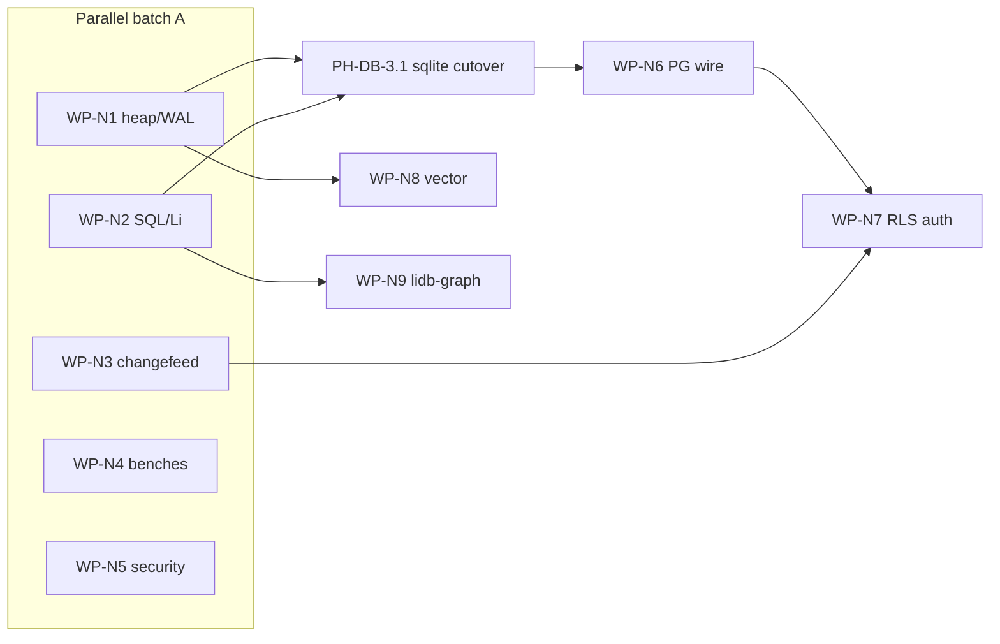

# lidb / lis native Li — competitor feature matrices

**Status:** Draft (PH-DB-0 / WP-N1 research)  
**Date:** 2026-05-25  
**Parent:** [`lidb-li-data-platform.md`](./lidb-li-data-platform.md), [`lidb-native-engine.md`](./lidb-native-engine.md)  
**Architecture ADR:** [`lidb/docs/architecture-native-li.md`](https://github.com/li-langverse/lidb/blob/main/docs/architecture-native-li.md)  
**PH / REQ:** PH-DB-0, PH-DB-3.1 (sqlite removal), REQ-registry-v2

## Li target (columns reference)

| Pillar | Li target (`lidb` + `lis`) |
|--------|----------------------------|
| **Core** | Postgres-*shaped* OLTP subset; registry-min ≤256 MiB; `lis db start` single process |
| **Security** | Parameterized-by-construction (`liorm`/`liq`); CVE harness; RLS + JWT (PH-DB-5); no agent raw SQL |
| **Memory** | Embedded heap + WAL; bounded prepared statements; profile-gated modules |
| **Perf/realtime** | `tier_db_registry` ≤1.2× Postgres P95; WAL logical decode → `lis` WS broker |
| **AI/agent** | `liq` AST → IR; schema MCP; catalog-bound idents; vector/graph as opt-in modules |
| **Gaps we close** | Remove **sqlite3 smoke** (PH-DB-3.1); native C++ storage; provable subset in `pg-subset-v1` |

---

## 1. OLTP RDBMS

| Product | Core features | Security | Memory model | Perf/realtime | AI/agent | Gaps vs Li target |
|---------|---------------|----------|--------------|---------------|----------|-------------------|
| **PostgreSQL** | Full SQL, MVCC, replication, extensions, `pg_catalog` | `pg_hba`, SCRAM, RLS, roles, audit extensions | Shared buffer pool + process per connection | Mature OLTP latency; logical replication; `LISTEN/NOTIFY` | `pgvector`, extensions, rich tooling | Li: **subset** only; no full extension surface; **oracle** for `tier_db_registry` |
| **MySQL** | InnoDB MVCC, replication, JSON | RBAC, TLS, audit plugin | Buffer pool; connection threads | High write throughput; less JSON/SQL std | HeatWave vector (vendor) | Li: Postgres-shaped DDL/registry, not MySQL dialect |
| **SQLite** | Embedded file DB, WAL mode, minimal types | App-level security; optional encryption ext | Single-writer; page cache in-process | Excellent embedded latency; no server fanout | Used as dev smoke only — **rejected** for Li ship | Li: **no sqlite3 dependency** (PH-DB-3.1); native heap instead |
| **DuckDB** | Columnar analytics, SQL, parquet | File access = trust boundary | Vectorized columnar; mmap | OLAP-fast; weak multi-writer OLTP | AI SQL extensions emerging | Li: OLTP registry path, not columnar-primary |
| **CockroachDB** | Distributed SQL, serializable default, geo | RBAC, encryption at rest, audit | Range replicas; distributed cache | Horizontal scale; higher tail latency | — | Li: **embedded single-node** first; no global HA in v1 |

---

## 2. BaaS stack

| Product | Core features | Security | Memory model | Perf/realtime | AI/agent | Gaps vs Li target |
|---------|---------------|----------|--------------|---------------|----------|-------------------|
| **Supabase** | Postgres + Auth + Storage + Realtime + Edge + Studio | RLS-first; JWT; API keys; hosted policies | Multi-container compose (~2–4 GiB local) | Realtime via WAL; REST via PostgREST | SQL + REST; AI templates | Li: **one `lis` process**, module flags; same vertical map, lean footprint |
| **Firebase** | Firestore/RTDB, Auth, Functions, Storage | Security rules DSL; Google IAM | NoSQL document model | RTDB low-latency sync | Gemini integrations | Li: **SQL + liq**, not document-primary |
| **Appwrite** | Auth, DB, Storage, Functions self-host | Teams, permissions, API keys | Docker stack | Realtime channels | SDK-first | Li: Postgres-shaped engine + Li ORM, not Mongo API |
| **Neon** | Serverless Postgres, branching, scale-to-zero | IAM, IP allow, Postgres RLS | Storage/compute split | Cold start; branching for dev | — | Li: **embedded** registry-min; borrow branching ideas later |

---

## 3. Graph

| Product | Core features | Security | Memory model | Perf/realtime | AI/agent | Gaps vs Li target |
|---------|---------------|----------|--------------|---------------|----------|-------------------|
| **Neo4j** | Property graph, Cypher, ACID | RBAC, LDAP, audit | Native graph store + page cache | Traversal-optimized | GraphRAG patterns | Li: **WP-N9 `lidb-graph` module** later; v1 = CTE/closure tables |
| **Memgraph** | In-memory graph, Cypher | Enterprise auth | RAM-primary | Low-latency analytics | — | Li: bounded RAM profile; graph optional |
| **Kùzu** | Embedded graph, Cypher | File trust | Embedded columnar/graph | Fast analytical graph | — | Li: compare for **embedded** graph spike only |
| **Apache AGE** | Graph in Postgres (openCypher) | Postgres RLS inheritance | Postgres storage | Depends on PG | — | Li: AGE as **parity oracle** for “need native graph?” |

---

## 4. Vector / AI DB

| Product | Core features | Security | Memory model | Perf/realtime | AI/agent | Gaps vs Li target |
|---------|---------------|----------|--------------|---------------|----------|-------------------|
| **pgvector** | `vector` type, IVFFlat/HNSW in Postgres | Postgres RLS | Postgres shared buffers | ANN recall/latency tradeoffs | RAG in SQL | Li: **WP-N8 native** HNSW module; no extension baggage in registry-min |
| **Pinecone** | Managed ANN, namespaces, metadata filters | API keys, SSO | Cloud-only | Low-latency query at scale | RAG-first UX | Li: self-hosted embedded option for registry artifacts |
| **Qdrant** | HNSW, filtering, quantization | API key, TLS | Rust service / embedded | High QPS ANN | Payload + vector | Li: optional module; bench vs pgvector |
| **Weaviate** | Schema + vector + hybrid search | AuthN/Z modules | Service heap | GraphQL API | Generative modules | Li: **liq** not GraphQL-first |
| **Chroma** | Embedded + server, metadata | Local trust | Embedded SQLite (!) | Dev-friendly | LangChain default | Li: reject Chroma’s sqlite core; native vector store |

---

## 5. Realtime

| Product | Core features | Security | Memory model | Perf/realtime | AI/agent | Gaps vs Li target |
|---------|---------------|----------|--------------|---------------|----------|-------------------|
| **Supabase Realtime** | Postgres logical replication → Phoenix channels | JWT on subscribe; RLS-shaped filters | Elixir + PG replication slot | WebSocket fanout | Client libs | Li: **WAL decode in `lidb`**, broker in **`lis`** (WP-N3); not in registry-min |
| **Firebase RTDB** | JSON tree sync | Security rules | Firebase backend | ms sync | Client SDKs | Li: row/event model from WAL, not JSON tree |
| **Ably** | Pub/sub, presence, history | API keys, token auth | Managed | Global edge | — | Li: optional external bridge; default in-process |
| **Electric SQL** | PG sync → local SQLite | Auth sync rules | SQLite on client | Offline-first | — | Li: **no sqlite** on server; embedded `lidb` for agents |

---

## 6. Auth

| Product | Core features | Security | Memory model | Perf/realtime | AI/agent | Gaps vs Li target |
|---------|---------------|----------|--------------|---------------|----------|-------------------|
| **GoTrue** | JWT, magic link, OAuth hooks | bcrypt, JWT refresh, hooks | Sidecar service | Auth latency low | Supabase client | Li: **`lis` auth module** + `lidb` RLS claims (WP-N7) |
| **Auth0** | Universal login, MFA, rules | Enterprise compliance | SaaS | — | Actions | Li: publisher JWT + API keys first; OAuth via `li-oauth` package |
| **Clerk** | Session, components, orgs | Hosted | SaaS | — | DX | Li: no UI vendor lock-in; capability model in engine |

---

## 7. Storage

| Product | Core features | Security | Memory model | Perf/realtime | AI/agent | Gaps vs Li target |
|---------|---------------|----------|--------------|---------------|----------|-------------------|
| **S3** | Object store, versioning, IAM | IAM policies, SSE | Server-side | Throughput scale | — | Li: **blob vertical** in `lidb` + `lis` proxy (PH-DB-6) |
| **MinIO** | S3-compatible self-host | IAM, TLS | Go heap | High throughput | — | Li: S3 API subset for attestations/artifacts |
| **Supabase Storage** | Buckets + RLS policies | JWT + bucket policies | PG metadata + object backend | CDN hooks | — | Li: same policy story tied to publisher JWT |

---

## 8. ORM / query

| Product | Core features | Security | Memory model | Perf/realtime | AI/agent | Gaps vs Li target |
|---------|---------------|----------|--------------|---------------|----------|-------------------|
| **Prisma** | Schema-first ORM, migrations | Parameterized queries; raw SQL escape hatch | Node heap | N+1 risk | Prisma AI (vendor) | Li: **`liorm` plan IDs** + catalog idents; no string SQL from agents |
| **Drizzle** | SQL-like TS ORM | Prepared statements | Light | Close to SQL | — | Li: **`liq`** slimmer for token budget |
| **SQLAlchemy** | Python ORM/Core | SQL injection if misused | Python | Mature | — | Li: Python `liorm` embed only; security tests mandatory |
| **Hasura** | GraphQL on Postgres | RLS passthrough | Haskell + PG | Subscription load | GraphQL agents | Li: **liq + SQL**, optional read API via `lis` not GraphQL-first |

---

## Benchmark spectrum matrix (native Li gates)

Rows = evidence dimensions; columns = tier gate. Normative detail: [`benchmarks/docs/ecosystem/tier-db-registry-benchmark.md`](https://github.com/li-langverse/benchmarks/blob/main/docs/ecosystem/tier-db-registry-benchmark.md).

| Dimension | Tier name | Oracle | Gate threshold |
|-----------|-----------|--------|----------------|
| **Security** | `tier_db_security` | Postgres + CVE catalog stubs (`lidb/tests/security/`) | All mapped CWE stubs green in CI; no `LI_HOOK_ALLOW` bypass |
| **Memory** | `tier_db_footprint` | Supabase local compose (reference only) | **registry-min** idle ≤ **256 MiB** (`lidb/docs/footprint.md`) |
| **Perf latency** | `tier_db_registry` | PostgreSQL 15+ same DDL | P95 lidb/postgres ≤ **1.2** per scenario |
| **Throughput** | `tier_db_registry` | PostgreSQL 15+ | Publish + read QPS within 1.2× at fixed concurrency (nightly) |
| **Parallelizability** | `tier_db_parallel` (future) | Postgres parallel seq scan baseline | Document speedup; no gate until WP-N1 heap multi-thread |
| **Auditability** | `tier_db_audit` | Supabase audit logs shape | Structured JSON log per mutation; replay from WAL |
| **Provability** | `tier_db_proof` | `pg-subset-v1` + liq IR | No promoted feature without ADR + NOT list update |

---

## Work packages (native Li track)

### Parallel batch A (start together)

| WP | Title | Repo | Exit gate |
|----|-------|------|-----------|
| **WP-N1** | Native heap + WAL (C++) | `lidb` | WAL replay tests; no `sqlite3` in engine path |
| **WP-N2** | SQL parser + executor (Li/C++) | `lidb` | `001_registry.sql` native migrate + parameterized `INSERT`/`SELECT` |
| **WP-N3** | Realtime changefeed | `lidb` + `lis` | WAL logical decode → `Changefeed` → `lis` WS broker; `realtime-v1.md` |
| **WP-N4** | Benchmark matrix CI | `benchmarks` + `lidb` | `tier_db_registry` + spectrum rows ingested; optional nightly |
| **WP-N5** | Security / audit harness | `lidb` | `tests/security/run_all.sh` in ecosystem CI; audit JSON schema |

### Sequential after batch A

| WP | Title | Depends | Exit gate |
|----|-------|---------|-----------|
| **WP-N6** | PG wire subset | N1 + N2 | Simple query protocol; cap prepared statements |
| **WP-N7** | RLS + auth production | N4 smoke + PH-DB-5 policies | Publisher JWT + RLS enforcement + harness |
| **WP-N8** | Vector native | N1 | HNSW module; bench vs pgvector oracle |
| **WP-N9** | Graph module `lidb-graph` | N2 + research ADR | `tier_db_graph_registry` vs CTE @ 10⁵ edges |

**Integration gate (between A and wire):** PH-DB-3.1 — remove sqlite smoke from CI (`scripts/smoke.sh`, `embed_engine.py`, `embedded.cpp`); `lis db` uses native engine only.

---

## Agent continuation

1. **Read:** this file, [`lidb/docs/architecture-native-li.md`](https://github.com/li-langverse/lidb/blob/main/docs/architecture-native-li.md), [`lidb-native-engine.md`](./lidb-native-engine.md)
2. **Run:** `bash ../lidb/scripts/smoke.sh` (note deprecation banner until PH-DB-3.1)
3. **Pick WP:** squad on N1–N5 parallel; integrator owns PH-DB-3.1 after N1+N2 green
4. **Blocked on:** none for research merge; PH-DB-4 blocked on PH-DB-3.1 + registry bench smoke

## Links

- Platform ADR: [`lidb-li-data-platform.md`](./lidb-li-data-platform.md)
- Multi-model research: [`lidb-multi-model-gpu-research.md`](./lidb-multi-model-gpu-research.md)
- SQL NOT list: [lidb `pg-subset-v1.md`](https://github.com/li-langverse/lidb/blob/main/docs/pg-subset-v1.md)
