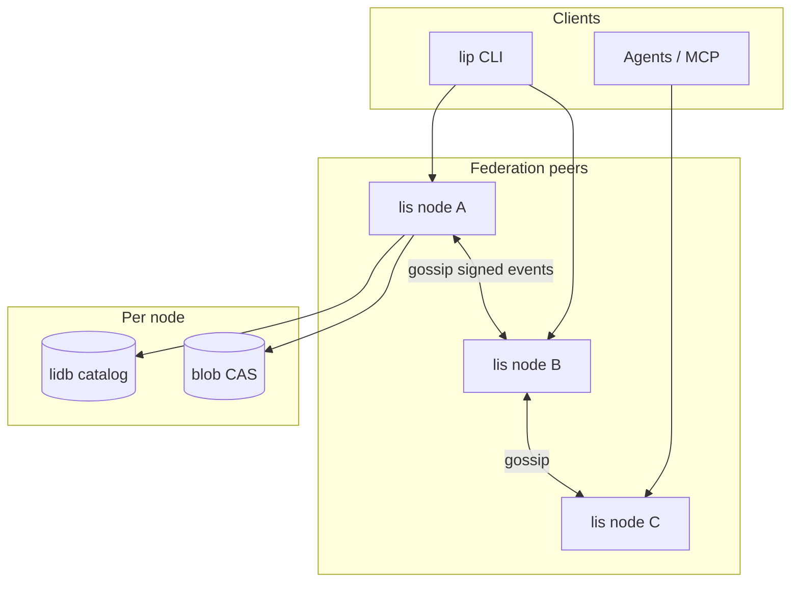

# lip decentralized registry (PH-REG-DECENT)

**Status:** Approved spec (2026-06-12)  
**Date:** 2026-06-12  
**PH / REQ:** PH-REG-DECENT (proposed), extends PH-DB-4 / REQ-registry-v2  
**Canonical spec:** [lip `docs/registry-decentralized.md`](https://github.com/li-langverse/lip/blob/main/docs/registry-decentralized.md)

## Context

PH-DB-4 delivers a **central** registry-min stack (`lis` + lidb + blob CAS) suitable for a single production URL (e.g. `lip.lilangverse.xyz`). That model works but creates a **single point of presence** for discovery and metadata.

Product requirement (2026-06-12):

- **Fully decentralized** — no canonical registry URL required
- **Open publish** — no censorship, gatekeeping, invites, or global blocklists
- **Account-based identity** — scoped `@handle/package` so official org releases (`@li-langverse/…`) are distinguishable from squatters without namespace police
- **Default peer hosting** — `lic` install enables capped seeding of packages already on disk; opt-out at install or via `lip peer off`

## Decision

Adopt **federated registry v3** as the long-term package index model:

1. **Scoped names** — `@account/package@version`
2. **Open accounts** — signup without tokens; ed25519-signed publishes
3. **Optional proofs** — dns/git/vouch badges for “official” clarity (not publish gates)
4. **Federation gossip** — many `lis` nodes replicate signed catalog events
5. **P2P overlay** (later) — optional `lip daemon` / DHT; same trust model
6. **Default seeding on install** — `lic` installer prompts; `peer.hosting = true` by default; bandwidth caps; `--no-peer-hosting` / `lip peer off`

PH-DB-4 central deployment becomes **one federation peer**, not a protocol requirement.

## Architecture

## Phased program

| Phase | Scope | Repo | Blocker |
|-------|-------|------|---------|
| **1** | Scoped schema, blob PUT in `lip publish`, signed publish | `lip`, `lidb`, `lis` | PH-DB-4 routes on `main` |
| **2** | `lip install` from blobs; `lip peer serve` | `lip` | Phase 1 |
| **3** | Open signup; account proofs API; deprecate global blocklist | `lis` | Auth lidb backend |
| **4** | Federation gossip; `federation.toml`; multi-bootstrap | `lis`, `lip` | Phase 1–3 |
| **5** | `lip daemon` P2P overlay (optional) | `lip`, new crate/module | Phase 4 |

## Trust model

| Mechanism | Role |
|-----------|------|
| Publisher signature | Proves account published this digest |
| `tree_digest` / `proof_digest` | Proves artifact integrity |
| Scoped name | Disambiguates publishers |
| Proofs (dns/git/vouch) | **Labels** for official clarity — never blocks publish |
| Client `prefer` / `ignore` | Consumer policy — not network censorship |

## Official org packages

[official-packages.md](../docs/ecosystem/official-packages.md) rows SHOULD publish under `@li-langverse/<pkg>` with dns + git proofs. The table remains the **org inventory**; the registry does not reserve names.

## Deprecations (federation mode)

| Artifact | Action |
|----------|--------|
| `blocklist` table enforcement | Deprecate for federation nodes |
| `signup_tokens` gated signup | Not default; private labs only |
| Single `LIP_REGISTRY_URL` required | Replace with `federation.toml` bootstrap list |
| Flat `packages.name UNIQUE` | Migrate to scoped `(account_id, name)` |

## Non-goals

- Protocol-level moderation or reserved global names
- npm/pypi compatibility
- Replacing hosted-git publish path (remains valid)

## References

- [lip/docs/registry-decentralized.md](https://github.com/li-langverse/lip/blob/main/docs/registry-decentralized.md)
- [lis/docs/registry-federation.md](https://github.com/li-langverse/lis/blob/main/docs/registry-federation.md)
- [lidb-li-data-platform.md](./lidb-li-data-platform.md) — PH-DB program
- [official-packages.md](../docs/ecosystem/official-packages.md)
